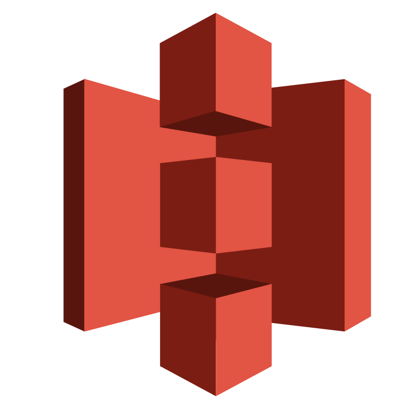

<h1 align="center">
  
</h1>

 

  Hi, I'm Shivansh, Computer Engineer & Software Developer from India
   
   
    💻 I build products across the entire tech stack  

   
    🌐 Web, 📱 Mobile, 🤖 AI, ⚙️ Automations — I do it all  

   
    🚀 From zero to launch: design, code, ship, scale  
   
    🤖 I also have built AI systems that power autonomous UAVs and UGVs

   
  ❤️ I love writing code and learn anythings about it
   
    🔥 Always building. Always shipping. Always leveling up.

   
  💬 Ask me anything about from <a href="https://github.com/shivanshxdev/shivanshxdev/issues" title="Issues">Here</a>
   
  📫 How to reach me: <a href="mailto: shivanshchauhan2005@gmail.com">gmail</a>

<h2 align="center">🔥 Languages & Frameworks & Tools & Abilities 🔥</h2>
 

  <!-- Languages -->
  <code></code>
  <code></code>
  <code></code>
  <code></code>
  <code></code>
  <code></code>
  <code></code>
  <code></code>
   
  <code></code>
  <code></code>
  <!-- Frameworks / Libraries -->
  <code></code>
  <code></code>
  <code></code>
  <code></code>
  <code></code>
  <code></code>
  <code></code>
  <code></code>
  
   
  <!-- Tools / Platforms -->
  <code></code>
  <code></code>
  <code></code>
  <code></code>
  <code></code>
  <code></code>
  <code></code>
  <code></code>
  <code></code>
  <code></code>
  <code></code>
  <code></code>
  <code></code>
  <code></code>

<h2 align="center">⚡ Stats ⚡</h2>
 

  

    
    
  

           
  

    
  

   

  

<h4 align="center">
  <a href="https://github.com/shivanshxdev?tab=repositories" title="Show Repositories">🔎 Show More 🔍</a>
</h4>
